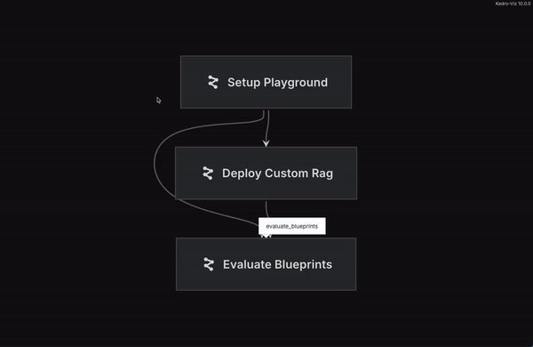

# AutoRAG - OG

Welcome to the repo for the first repeatable attempt at AutoLM selection

## What is AutoRAG?

AutoRAG is a project that aims to automate the process of creating and deploying a QA Bot with all the functionality available within the DataRobot platform. This includes multiple basic RAG setups and vector stores as well as a few custom RAG setups. Each of these will be evaluated against a dataset of QA Pairs.

## Why AutoRAG

Do I even need to answer? DataRobot is the AutoML platform. Helping people pick the best language model is the next logical step in the process

## Getting started

1. Clone the repo
2. (if needed) Set up a virtual environment
3. `pip install -r requirements.txt`
4. Fill out your `.env` file
5. `pulumi login --local`
6. `source set_env.sh`
7. Initialize a stack with `pulumi stack init`
8. Run the kedro pipeline with `kedro run`
9. Build the deployment and app with `pulumi up`